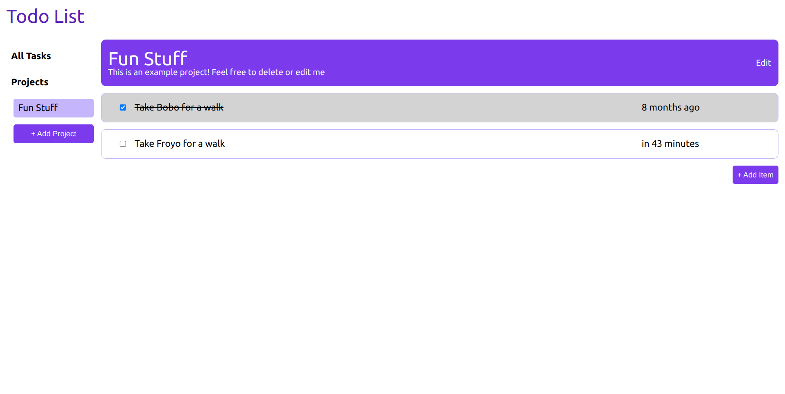

# ToDo List

## [Live DEMO](https://sykoivisto.github.io/todo-list/)

## Description

I built this project to practice building JavaScript applications using ES6 Modules, Factory Functions, OOP Principles, localStorage, and Webpack.

This project includes objects that are dynamically created, and renders page content dynamically from these objects. A big part of this project was organizing the code efficiently, including using separate single-purpose modules and functions, as well as keeping application logic separated from the dom related stuff.

## Features

Create projects to sort your tasks  
Create tasks with a description, priority, and due date  
Expand the tasks to view more details (project page only)  
Navigate between projects or the all tasks view  
Edit and/or delete the details of projects and tasks  
Mark tasks as completed  
Color coded priority of tasks  
Due date of expanded tasks colored red if overdue  
Data is stored locally

## Credits

Special thanks to [The Odin Project](https://www.theodinproject.com/).

## Tools used

[DateFNS](https://date-fns.org/)

  
  
  
  
